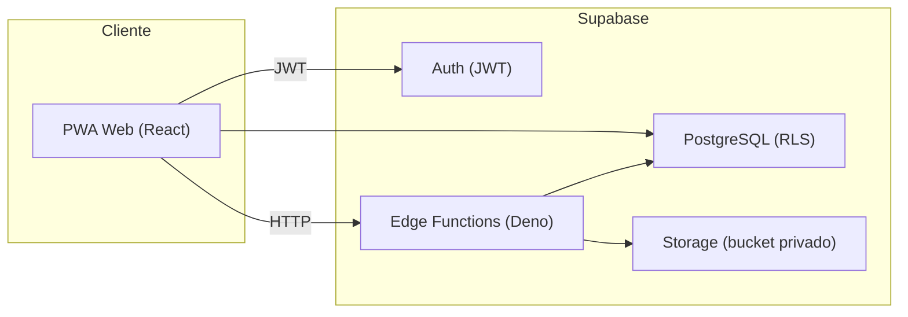
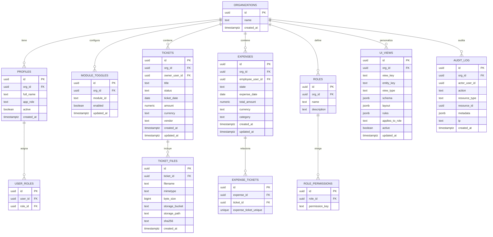

## 1. Diseño de arquitectura



## 2. Descripción de tecnologías
- Frontend: React@18 + TypeScript + Vite.
- UI: TailwindCSS + componentes propios (sin librerías “copiadas” o derivadas de suites específicas).
- State/Fetch: TanStack Query (si se adopta) o fetch + hooks; mantener abstracción por capas.
- Backend: Supabase (Auth + Postgres + Storage + Edge Functions).
- Testing:
  - Unit/Integration: Vitest + Testing Library.
  - E2E: Playwright.
  - Cobertura: V8 coverage con umbral mínimo 80% (global y por carpeta “core”).

## 3. Enrutado (PWA)
| Ruta | Propósito | Permisos |
|------|-----------|----------|
| /login | Auth | Público |
| / | Dashboard | auth |
| /tickets | Listado tickets | tickets.read |
| /tickets/:id | Detalle ticket | tickets.read |
| /gastos | Listado gastos | expenses.read |
| /gastos/:id | Detalle gasto | expenses.read |
| /informes | Informes | reports.read |
| /admin | Admin central | admin.access |
| /admin/vistas | Constructor de vistas | views.manage |
| /admin/modulos | Activación módulos | modules.manage |
| /admin/auditoria | Auditoría | audit.read |

## 4. Arquitectura modular (núcleo + módulos)

### 4.1 Principios
- Núcleo pequeño y estable: auth, navegación, RBAC, auditoría, motor de vistas, registro de módulos.
- Módulos autocontenidos: rutas, permisos, páginas, servicios de datos y “manifest”.
- Módulos activables/desactivables por configuración (en BD) sin recompilar.

### 4.2 Contrato de módulo (manifest)
Cada módulo exporta un manifest con:
- `id`, `name`, `version`
- `requiredPermissions` (permisos que introduce)
- `routes` (definición de rutas y guardas)
- `navItems`
- `entities` (opcional: definición de vistas por defecto y validaciones)

Carga:
- El núcleo mantiene un registry con manifests disponibles en el build.
- La BD controla qué módulos están “habilitados”.
- El cliente filtra navegación/rutas según módulos habilitados y permisos del usuario.

## 5. Definición de APIs (Edge Functions)

### 5.1 Convenciones
- Todas las funciones requieren JWT de Supabase y verifican permisos.
- Para descargas, emitir URLs firmadas de corta duración o “stream” mediante función.
- Todas las operaciones relevantes generan eventos de auditoría (append-only).

### 5.2 Endpoints propuestos

#### `POST /audit/append`
Inserta un evento de auditoría (para acciones que ocurren en cliente, con verificación server-side opcional).

#### `POST /storage/sign-download`
Devuelve URL firmada para un objeto de Storage.
- Request: `bucket`, `path`, `resource_type`, `resource_id`
- Response: `signed_url`, `expires_in`

#### `POST /storage/sign-upload`
Devuelve URL firmada o credenciales de subida (si se decide subida directa) con validación previa.

#### `POST /downloads/create-batch`
Crea lote de descarga (lista de URLs firmadas) para una selección.

## 6. Modelo de datos

### 6.1 ERD (con campo org_id preparado para futuro)


### 6.2 DDL (Supabase Postgres)
```sql
create table if not exists public.organizations (
  id uuid primary key default gen_random_uuid(),
  name text not null,
  created_at timestamptz not null default now()
);

create table if not exists public.profiles (
  id uuid primary key references auth.users(id) on delete cascade,
  org_id uuid not null references public.organizations(id) on delete restrict,
  full_name text,
  app_role text not null default 'user',
  active boolean not null default true,
  created_at timestamptz not null default now()
);

create table if not exists public.module_toggles (
  id uuid primary key default gen_random_uuid(),
  org_id uuid not null references public.organizations(id) on delete cascade,
  module_id text not null,
  enabled boolean not null default true,
  updated_at timestamptz not null default now(),
  unique (org_id, module_id)
);

create table if not exists public.roles (
  id uuid primary key default gen_random_uuid(),
  org_id uuid not null references public.organizations(id) on delete cascade,
  name text not null,
  description text,
  unique (org_id, name)
);

create table if not exists public.role_permissions (
  id uuid primary key default gen_random_uuid(),
  role_id uuid not null references public.roles(id) on delete cascade,
  permission_key text not null,
  unique (role_id, permission_key)
);

create table if not exists public.user_roles (
  id uuid primary key default gen_random_uuid(),
  user_id uuid not null references auth.users(id) on delete cascade,
  role_id uuid not null references public.roles(id) on delete cascade,
  unique (user_id, role_id)
);

create table if not exists public.tickets (
  id uuid primary key default gen_random_uuid(),
  org_id uuid not null references public.organizations(id) on delete cascade,
  owner_user_id uuid not null references auth.users(id) on delete restrict,
  title text not null,
  status text not null default 'draft',
  ticket_date date,
  amount numeric(16,2),
  currency text default 'EUR',
  vendor text,
  created_at timestamptz not null default now(),
  updated_at timestamptz not null default now()
);

create index if not exists tickets_org_date_idx
  on public.tickets (org_id, ticket_date desc);

create table if not exists public.ticket_files (
  id uuid primary key default gen_random_uuid(),
  ticket_id uuid not null references public.tickets(id) on delete cascade,
  filename text not null,
  mimetype text,
  byte_size bigint,
  storage_bucket text not null default 'tickets-cotepa',
  storage_path text not null,
  sha256 text not null,
  created_at timestamptz not null default now()
);

create index if not exists ticket_files_ticket_idx
  on public.ticket_files (ticket_id);

create table if not exists public.expenses (
  id uuid primary key default gen_random_uuid(),
  org_id uuid not null references public.organizations(id) on delete cascade,
  employee_user_id uuid not null references auth.users(id) on delete restrict,
  state text not null default 'draft',
  expense_date date,
  total_amount numeric(16,2),
  currency text default 'EUR',
  category text,
  created_at timestamptz not null default now(),
  updated_at timestamptz not null default now()
);

create index if not exists expenses_org_date_idx
  on public.expenses (org_id, expense_date desc);

create table if not exists public.expense_tickets (
  id uuid primary key default gen_random_uuid(),
  expense_id uuid not null references public.expenses(id) on delete cascade,
  ticket_id uuid not null references public.tickets(id) on delete cascade,
  unique (expense_id, ticket_id)
);

create table if not exists public.ui_views (
  id uuid primary key default gen_random_uuid(),
  org_id uuid not null references public.organizations(id) on delete cascade,
  view_key text not null,
  entity_key text not null,
  view_type text not null,
  schema jsonb not null default '{}'::jsonb,
  layout jsonb not null default '{}'::jsonb,
  rules jsonb not null default '{}'::jsonb,
  applies_to_role text,
  active boolean not null default true,
  updated_at timestamptz not null default now(),
  unique (org_id, view_key)
);

create table if not exists public.audit_log (
  id uuid primary key default gen_random_uuid(),
  org_id uuid not null references public.organizations(id) on delete cascade,
  actor_user_id uuid,
  action text not null,
  resource_type text not null,
  resource_id uuid,
  metadata jsonb not null default '{}'::jsonb,
  ip text,
  created_at timestamptz not null default now()
);

create index if not exists audit_log_org_created_idx
  on public.audit_log (org_id, created_at desc);
```

## 7. Políticas de seguridad (RLS + Storage)

### 7.1 RLS (principios)
- Toda tabla con datos de negocio requiere `org_id`.
- El usuario solo accede a su `org_id` (en MVP hay una organización, pero se mantiene el diseño escalable).
- Permisos finos en aplicación:
  - RLS limita “qué filas”.
  - RBAC limita “qué acciones” (crear, editar, aprobar, descargar, administrar).

### 7.2 Storage
- Bucket `tickets-cotepa` privado.
- Subidas:
  - Preferencia: subir mediante Edge Function (server-side) o URL firmada corta.
  - Validar tamaño, mimetype y calcular SHA-256 antes de insertar metadatos.
- Descargas:
  - Solo mediante Edge Function que emite URL firmada temporal y registra auditoría.

## 8. Estrategia de pruebas y cobertura
- Umbral: 80% global + 80% en `src/core/**`.
- Matriz:
  - Core RBAC (permisos, guardas de ruta, políticas UI).
  - Constructor de vistas (schema validation, reglas, render).
  - Subida/descarga (validación, hashing, flujos de errores).
  - Edge Functions (auth, permisos, signed URLs, auditoría).
- E2E (Playwright): escenarios de usuario + admin + aprobador.

## 9. Documentación y guía de creación de módulos
- Convención de carpetas:
  - `src/core/*` (shell, rbac, routing, views engine)
  - `src/modules/<moduleId>/*` (manifest, pages, services, tests)
- “Checklist de módulo”:
  - manifest + permisos + rutas + seeds de vistas + pruebas mínimas.
- Runbook:
  - Instalación local, variables de entorno, migraciones, despliegue demo.
