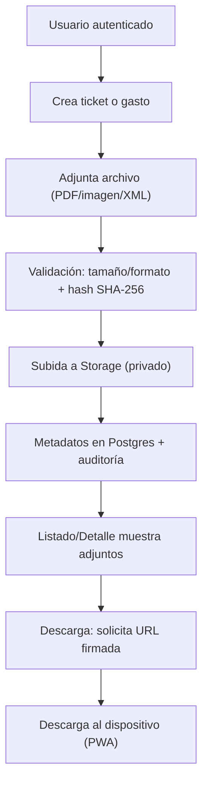

## 1. Visión del producto
Tickets Cotepa es una plataforma empresarial modular (tipo suite) para gestionar tickets/recibos y gastos con adjuntos, control de acceso granular, personalización de vistas sin tocar código y un sistema integrado de informes. La aplicación debe ser completamente original e independiente: no reutiliza código, dependencias, marcas, recursos ni elementos derivados de Odoo ni de software asociado.

- Usuarios objetivo: empleados (captura/consulta), responsables (aprobación), finanzas (control y reporting), administración TI (configuración, seguridad, auditoría).
- Objetivo: centralizar evidencias (tiquetes/recibos) y gastos de forma segura, auditable y configurable, con módulos activables/desactivables.

## 2. Funcionalidades núcleo

### 2.1 Roles de usuario
| Rol | Método de acceso | Permisos principales |
|-----|------------------|---------------------|
| Usuario | Supabase Auth (email) | Crear/editar sus registros, adjuntar archivos, ver y descargar propios |
| Aprobador | Supabase Auth | Ver registros asignados, aprobar/rechazar, descargar por lote |
| Finanzas | Supabase Auth | Acceso global a registros, informes, exportaciones, auditoría |
| Administrador | Supabase Auth + rol admin | Gestión de usuarios/roles, permisos, módulos, vistas, políticas |

### 2.2 Módulos funcionales (MVP)
1. **Núcleo (Core)**:
   - Shell de aplicación, navegación, sistema de módulos.
   - Panel de administración centralizado.
   - Sistema de roles y permisos granular (RBAC) + auditoría.
   - Motor de vistas/formularios configurables (sin modificar código).
2. **Módulo Tickets/Recibos**:
   - Alta y gestión de tickets con adjuntos (PDF/imágenes/XML).
   - Descarga individual/masiva, validación de integridad y trazabilidad.
3. **Módulo Gastos**:
   - Registro de gastos con categorías, importes, moneda, fecha, estado y aprobación simple.
   - Relación con tickets/recibos (1..n).
4. **Módulo Informes**:
   - Tableros con métricas (por periodo, estado, categoría, empleado).
   - Exportación a CSV y “snapshot” imprimible.

### 2.3 Detalle de páginas (MVP)
| Página | Módulo | Descripción funcional |
|--------|--------|------------------------|
| Login | Core | Acceso, recuperación, cierre de sesión |
| Dashboard | Core | KPIs, atajos, actividad reciente, errores |
| Tickets | Tickets/Recibos | Tabla + filtros + acciones masivas |
| Ticket detalle | Tickets/Recibos | Metadatos, adjuntos, auditoría del recurso |
| Gastos | Gastos | Tabla + filtros + aprobaciones simples |
| Gasto detalle | Gastos | Metadatos, relación con tickets, adjuntos |
| Informes | Informes | Selector de informe, filtros, exportación |
| Admin | Core | Usuarios, roles, permisos, módulos, vistas, auditoría |
| Constructor de vistas | Core | Editor no-code/low-code para formularios y tablas |

## 3. Procesos principales

### 3.1 Flujos de usuario
- Alta de ticket: crear registro → adjuntar archivos → validar → guardar → disponible para descarga.
- Alta de gasto: crear gasto → vincular ticket(s) → enviar a aprobación → aprobar/rechazar → auditoría.
- Descarga: seleccionar ticket(s) o adjunto(s) → comprobar permisos → generar URLs firmadas → descargar.
- Personalización: admin define una vista (campos visibles, orden, validaciones) → publica → aplica por rol.
- Módulos: admin activa/desactiva módulos → el shell ajusta navegación, rutas y permisos.

### 3.2 Diagrama de flujo (alta y descarga de adjuntos)

## 4. Diseño de interfaz (UX/UI)

### 4.1 Estilo
- Diseño enterprise moderno, claro y denso “controlado”: tablas potentes, filtros rápidos, navegación eficiente.
- Accesibilidad: contraste AA, navegación por teclado, estados claros.
- Responsivo: desktop-first con adaptación móvil; como PWA debe funcionar offline de forma limitada (caché de vistas y últimas listas, no de archivos sensibles).

### 4.2 Experiencia de usuario (requisitos clave)
- Acciones masivas con progreso y reintentos.
- Estados consistentes (pendiente/aprobado/rechazado/error).
- Historial de actividad por recurso (quién subió, descargó, editó).
- Constructor de vistas usable: previsualización, validación de esquema y control por rol.

## 5. Personalización sin código (alcance MVP)
- Formularios: reordenar campos, ocultar/mostrar, establecer requeridos, máscaras básicas (texto/moneda/fecha).
- Tablas: columnas, orden, filtros guardados, agrupaciones simples.
- Reglas: validaciones declarativas (p. ej. importe > 0) y condicionales básicas (si categoría = X → campo Y requerido).

## 6. Seguridad, cumplimiento y operación
- Archivos siempre privados: acceso solo vía URL firmada de corta duración o streaming controlado.
- Auditoría obligatoria para: alta, edición, descarga, cambios de permisos, cambios de vistas, activación de módulos.
- Retención: política configurable por tipo de documento/estado.

## 7. Requisitos de calidad y validación
- Cobertura mínima: 80% (núcleo + módulos MVP).
- Pruebas:
  - Unitarias: lógica de permisos, validación de esquema, hashing, orquestación UI.
  - Integración: Edge Functions + RLS + Storage (happy path y casos de rechazo).
  - E2E: login → crear ticket → subir adjunto → descargar → auditoría.
- Pruebas con usuarios finales:
  - Guion de tareas (10–12 tareas), recogida de tiempos y fricciones, encuesta SUS.
  - Informe final con hallazgos y acciones.

## 8. Entregables
- Repositorio con código fuente completo (original) y configuración.
- Entorno de demostración funcional accesible (URL) con dataset de ejemplo.
- Documentación técnica y de usuario (instalación, operación, creación de módulos).
- Informe de pruebas (unit/integration/e2e) y reporte de pruebas de usabilidad.
